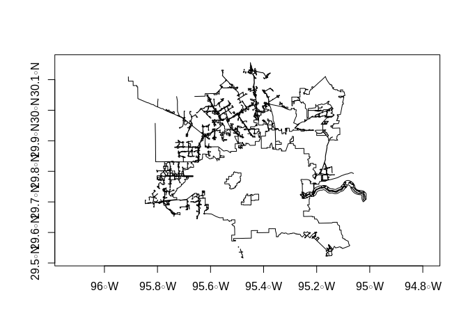
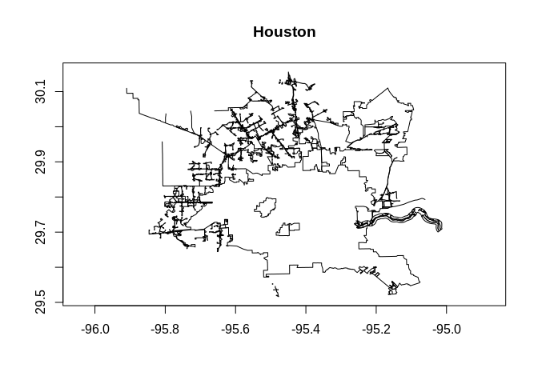
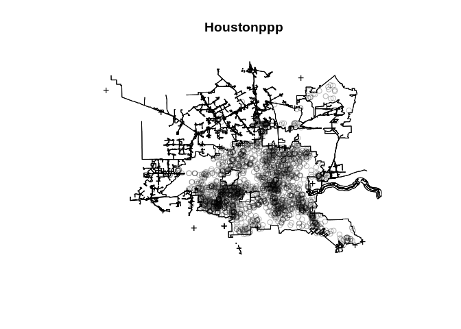

Estatística Espacial
================

## Trabalho - FGV - MBA Big Data

**Dados – Localizações das ocorrências de crimes na cidade de Houston.**

Elaboração um relatório com a análise do script do R, com comandos
comentados e conclusões sobre os problemas envolvidos no trabalho.

Definição de Diretorio

``` r
# Setando o diretorio de trabalho
setwd("/home/rennis/rennisHD00/Projetos/Pessoal/R/rennis-fgv-bigdata/estatistica-espacial/trabalho")
```

Pacotes Utilizados

    ## Loading required package: rgdal

    ## Loading required package: sp

    ## rgdal: version: 1.4-8, (SVN revision 845)
    ##  Geospatial Data Abstraction Library extensions to R successfully loaded
    ##  Loaded GDAL runtime: GDAL 2.4.2, released 2019/06/28
    ##  Path to GDAL shared files: /usr/share/gdal
    ##  GDAL binary built with GEOS: TRUE 
    ##  Loaded PROJ.4 runtime: Rel. 5.2.0, September 15th, 2018, [PJ_VERSION: 520]
    ##  Path to PROJ.4 shared files: (autodetected)
    ##  Linking to sp version: 1.3-2

    ## Loading required package: maptools

    ## Checking rgeos availability: TRUE

    ## Loading required package: dplyr

    ## 
    ## Attaching package: 'dplyr'

    ## The following objects are masked from 'package:stats':
    ## 
    ##     filter, lag

    ## The following objects are masked from 'package:base':
    ## 
    ##     intersect, setdiff, setequal, union

    ## Loading required package: spatstat

    ## Loading required package: spatstat.data

    ## Loading required package: nlme

    ## 
    ## Attaching package: 'nlme'

    ## The following object is masked from 'package:dplyr':
    ## 
    ##     collapse

    ## Loading required package: rpart

    ## 
    ## spatstat 1.61-0       (nickname: 'Puppy zoomies') 
    ## For an introduction to spatstat, type 'beginner'

    ## 
    ## Note: spatstat version 1.61-0 is out of date by more than 3 months; we recommend upgrading to the latest version.

    ## Loading required package: ggmap

    ## Loading required package: ggplot2

    ## Google's Terms of Service: https://cloud.google.com/maps-platform/terms/.

    ## Please cite ggmap if you use it! See citation("ggmap") for details.

    ## Loading required package: leaflet

    ## Loading required package: leaflet.extras

    ## Loading required package: lubridate

    ## 
    ## Attaching package: 'lubridate'

    ## The following object is masked from 'package:base':
    ## 
    ##     date

Leitura da BAse de Dados de Crimes Disponibilizada

``` r
crimes <- read.csv("../dataset/Base Houston.csv")
```

Avaliando as características gerais dos
    dados

``` r
summary(crimes)
```

    ##              time             date           hour          premise   
    ##  21/04/10 03:00:   6   4/20/2010:  18   Min.   : 0.00   20A    :450  
    ##  15/07/10 03:00:   4   07/12/10 :  17   1st Qu.: 5.00   20R    :355  
    ##  24/07/10 04:00:   4   1/15/2010:  17   Median :14.00   18A    :302  
    ##  28/08/10 06:00:   4   7/21/2010:  17   Mean   :12.52   13R    :264  
    ##  02/03/10 14:00:   3   04/05/10 :  16   3rd Qu.:20.00   20D    :103  
    ##  02/04/10 03:00:   3   05/01/10 :  16   Max.   :23.00   250    : 81  
    ##  (Other)       :2224   (Other)  :2147                   (Other):693  
    ##                offense          beat            block             street    
    ##  aggravated assault:398   19G10   :  71   1200-1299:  36   bellfort  :  33  
    ##  auto theft        :450   6B60    :  59   7600-7699:  32   gessner   :  33  
    ##  burglary          :389   13D20   :  55   1300-1399:  31   westheimer:  32  
    ##  murder            :157   14D20   :  52   5800-5899:  30   tidwell   :  30  
    ##  rape              :376   3B10    :  52   5500-5599:  28   beechnut  :  29  
    ##  robbery           :478   1,70E+11:  50   6300-6399:  27   bissonnet :  29  
    ##                           (Other) :1909   (Other)  :2064   (Other)   :2062  
    ##       type     suffix       number          month            day     
    ##  dr     :564   -:1979   Min.   :1.000   may    :317   friday   :318  
    ##         :510   E:  40   1st Qu.:1.000   july   :306   monday   :349  
    ##  st     :389   N:  30   Median :1.000   june   :283   saturday :372  
    ##  rd     :355   S:  82   Mean   :1.029   march  :280   sunday   :320  
    ##  ln     :124   W: 117   3rd Qu.:1.000   april  :277   thursday :283  
    ##  blvd   :105            Max.   :5.000   august :274   tuesday  :303  
    ##  (Other):201                            (Other):511   wednesday:303  
    ##                      location                address          lon        
    ##  apartment               :450     50 goodson dr  :   7   Min.   :-95.93  
    ##  residence / house       :355   12250 fleming dr :   7   1st Qu.:-95.51  
    ##  apartment parking lot   :302   6350 bellfort st :   7   Median :-95.41  
    ##  road / street / sidewalk:264   7650 curry rd    :   6   Mean   :-95.42  
    ##  driveway                :103   7750 corporate dr:   6   3rd Qu.:-95.34  
    ##  (Other)                 :696   1350 greens pkwy :   5   Max.   :-95.08  
    ##  NA's                    : 78   (Other)          :2210                   
    ##       lat       
    ##  Min.   :29.54  
    ##  1st Qu.:29.68  
    ##  Median :29.73  
    ##  Mean   :29.75  
    ##  3rd Qu.:29.81  
    ##  Max.   :30.10  
    ## 

``` r
summary(crimes$offense)
```

    ## aggravated assault         auto theft           burglary             murder 
    ##                398                450                389                157 
    ##               rape            robbery 
    ##                376                478

``` r
summary(crimes$day)
```

    ##    friday    monday  saturday    sunday  thursday   tuesday wednesday 
    ##       318       349       372       320       283       303       303

``` r
summary(crimes$hour)
```

    ##    Min. 1st Qu.  Median    Mean 3rd Qu.    Max. 
    ##    0.00    5.00   14.00   12.52   20.00   23.00

Importação do shapefile de
Houston

``` r
HoustonShp <- readOGR("../map/Houston_City_Limit/Houston_City_Limit.shp")
```

    ## OGR data source with driver: ESRI Shapefile 
    ## Source: "/home/rennis/rennisHD00/Projetos/Pessoal/R/rennis-fgv-bigdata/estatistica-espacial/map/Houston_City_Limit/Houston_City_Limit.shp", layer: "Houston_City_Limit"
    ## with 743 features
    ## It has 22 fields
    ## Integer64 fields read as strings:  OBJECTID

Identificando o tipo de coordenadas através da visualização do eixo

``` r
plot(HoustonShp, axes=TRUE)
```

<!-- -->

Verificando dimensionalidade

``` r
dim(crime)
```

    ## [1] 86314    17

Preparando o shape para ser utilizado pela biblioteca spatstat Devido a
caracteristicas da biblioteca, e necessario customização para funcionar
no Linux \*\* Houston \<- as.owin(HoustonShp) \# Windows ** ** Houston
\<- .sp2owin(HoustonShp) \# Linux \*\*

``` r
# Customização para Linux
if(!exists(".sp2owin", mode="function")) source("../../utils/sp2owin.R")
Houston <- .sp2owin(HoustonShp)
```

Plotando

``` r
plot(Houston, axes = TRUE)
```

<!-- -->

Criação de um padrão de pontos a ser
    plotado

``` r
Houstonppp = ppp(crimes$lon, crimes$lat, window=Houston)
```

    ## Warning: 45 points were rejected as lying outside the specified window

    ## Warning: data contain duplicated points

``` r
plot(Houstonppp, axes=TRUE)
```

    ## Warning in plot.ppp(Houstonppp, axes = TRUE): 45 illegal points also plotted

<!-- -->

\*\* Estimação da funcao G \*\* Gest - estima a funcao de distribuicao G
de um padrao de pontos

``` r
Houston.G <- Gest(Houstonppp) 
Houston.G
```

    ## Function value object (class 'fv')
    ## for the function r -> G(r)
    ## .....................................................................
    ##         Math.label      Description                                  
    ## r       r               distance argument r                          
    ## theo    G[pois](r)      theoretical Poisson G(r)                     
    ## han     hat(G)[han](r)  Hanisch estimate of G(r)                     
    ## rs      hat(G)[bord](r) border corrected estimate of G(r)            
    ## km      hat(G)[km](r)   Kaplan-Meier estimate of G(r)                
    ## hazard  hat(h)[km](r)   Kaplan-Meier estimate of hazard function h(r)
    ## theohaz h[pois](r)      theoretical Poisson hazard function h(r)     
    ## .....................................................................
    ## Default plot formula:  .~r
    ## where "." stands for 'km', 'rs', 'han', 'theo'
    ## Recommended range of argument r: [0, 0.0059925]
    ## Available range of argument r: [0, 0.016407]

\*\* Estimando a funcao K \*\* Kest - estima a funcao K de Ripley de um
padrao de pontos

``` r
# Houston.K <- Kest(Houstonppp)
```

\*\* Estimando a funcao F \*\* Houston.F \<- Fest(Houstonppp)
